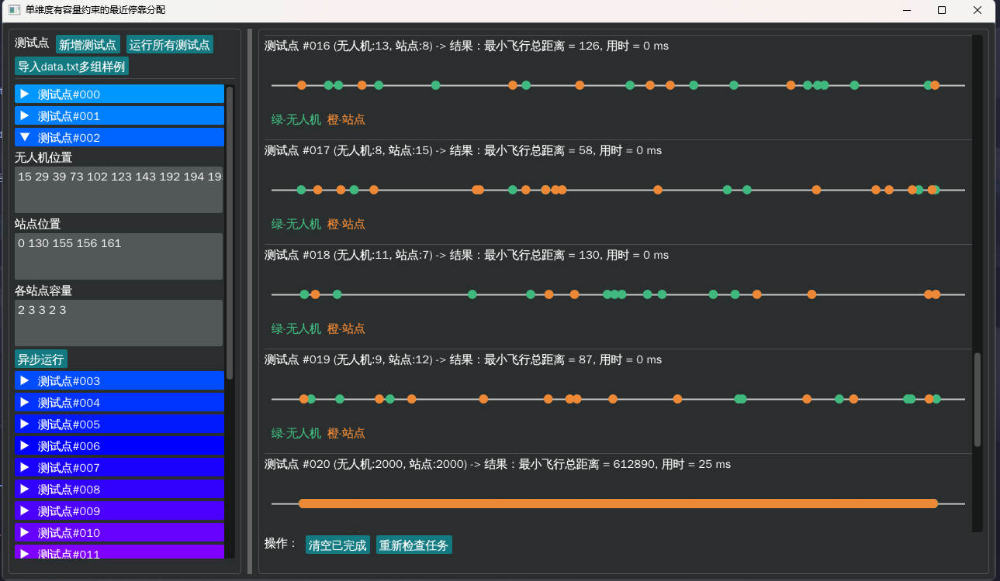

# 无人机最小总飞行距离分配调度系统

(This is the GUI implementation of the algorithm system)

Idea and author: **Blume** https://blog.yamero.cc/

在沿海城市杭市我们最近部署了一套无人机系统，多部无人机沿着一条固定的直线路线来回飞行。
由于当地天气不稳定，我们在这条直线上多个位置部署了无人机的停靠站，每个停靠站用坐标x和容量c表示。
给出某时刻所有无人机的坐标，求所有无人机都飞到停靠站停靠的总飞行距离总和是多少?




## 解析

可以建模为一个**单维度有容量约束的最近停靠分配问题**
即在一条数轴上（沿固定直线路线），将所有无人机分配到合适的停靠站，使得总飞行距离最小，且满足停靠站的容量约束。

1. **输入：**
- $D = \{d_1, d_2, ..., d_m\}$：$m$ 个无人机的位置。
- $P = \{p_1, p_2, ..., p_n\}$：$n$ 个停靠点的坐标及其容量限制 $C(p_i)$。
- $c(d_i, p_j)$：无人机 $d_i$ 飞行至停靠点 $p_j$ 的距离。

2. **约束条件：**
- 每个无人机必须被分配到一个停靠点，并能够成功降落。
- 每个停靠点的总停靠无人机数量不能超过其容量约束 $C(p_i)$。

3. **目标函数：**
- 设 $x_{ij}$ 为决策变量，若无人机 $d_i$ 选择停靠点 $p_j$ 则 $x_{ij} = 1$，否则 $x_{ij} = 0$。
- 目标是最小化总飞行距离：$\min \sum_{i=1}^{m} \sum_{j=1}^{n} \text{dist}(d_i, p_j)$
### 输入格式

第一行给出两个整数 m, n，分别表示无人机的数量和停靠站的数量
第二行给出 m 个整数，第 i 个整数表示无人机 i 的初始位置
第三行给出 n 个整数，第 i 个整数表示停靠站 i 的初始位置
第四行给出 n 个整数，第 i 个整数表示停靠站 i 的容量
### 输出格式

一个整数，表示将所有无人机分配到合适的停靠站的最小总飞行距离
### 样例1
#### 输入

```
4 4
2 6 12 16
0 4 10 14
2 2 2 2
```
#### 输出

```
8
```
### 样例2
#### 输入

```
4 4
2 6 12 16
0 4 10 14
0 0 0 100
```
#### 输出

```
24
```
## 方法：贪心

1. **按无人机位置排序**：将所有无人机按 x 坐标升序排列。
2. **按停靠站排序**：将停靠站按 x 坐标升序排列。
3. **逐个分配**：从左到右遍历无人机，每次分配到最近且有剩余容量的停靠站。

但是这个方法无法达到全局最优解：如果一个无人机选了某个停靠站，那么它有可能影响到后面的决策
局部最优的“就近停靠”决策让后续无人机的选择变差了

## 方法：动态规划

### **1. 基本 DP 转移**

定义 $dp[i]$ 表示前 $i$ 个无人机（按顺序）分配完毕的最小总飞行距离。
当当前停靠站（坐标为 $X$，容量为 $c_j$）负责为一段连续的无人机服务时，如果该站负责无人机下标区间 $[k, i)$（即分配 $i-k$ 个无人机），则这部分花费为：
$$
\text{cost}(k, i, X) = \sum_{t=k}^{i-1} |D[t]-X|.
$$
要保证分配的无人机数不超过容量，还需要 $i-k \leq c_j$，即 $k \geq \max(0, i-c_j)$。因此状态转移应写为：
$$
dp[i] = \min_{\max(0, i - c_j) \leq k \lt i} \{ dp[k] + \text{cost}(k, i, X) \}
$$
### **2. 前缀和优化**

注意到站点 $X$ 固定，于是我们可以利用前缀和快速计算区间内的绝对距离和，构造前缀和数组 $Q$：
$$

Q[0] = 0, \quad Q[i] = \sum_{t=0}^{i-1} |D[t]-X|.

$$
于是区间 $[k, i)$ 的花费可以写为：
$$
\text{cost}(k, i, X) = Q[i]-Q[k].
$$

因此，上述状态转移公式可以改写为：
$$
dp[i] = \min_{\max(0, i - c_j) \leq k < i} \{ dp[k] + Q[i] - Q[k] \}.
$$
或进一步整理为：
$$
dp[i] = Q[i] + \min_{\max(0, i - c_j) \leq k < i} \{ dp[k] - Q[k] \}.
$$
### **3. 滑动窗口/单调队列优化**

如果令 $\text{newdp}[i] = dp[i]$ 为更新后的状态，则对于当前站点，状态转移可以写为：
$$
\text{newdp}[i] = Q[i] + \min_{\max(0, i - c_j) \leq k < i} \{ dp[k] - Q[k] \}.
$$

在计算新状态时，我们只需要维护一个**有效的滑动窗口**，以便快速计算出当前区间内的最小值。
需要处理的区间是 $k \in [\max(0, i - c_j), i)$。可以将这个区间视为一个滑动窗口，每次更新状态时，窗口右端会扩展到 $i$，而左端则保持在 $\max(0, i - c_j)$。
要维护窗口中所有 $dp[k] - Q[k]$ 的最小值。为了快速维护这个最小值，我们可以使用 **单调队列**。

具体步骤如下：
1. **队列中的元素**是下标 $k$，对应的值是 $dp[k] - Q[k]$。
2. 对于每次更新 $i$，我们：
    - 从队列的队尾移除不再符合窗口条件的元素（即当 $k$ 超出有效范围 $[\max(0, i - c_j), i)$ 时，移除这些元素）。
    - 将当前状态 $dp[i] - Q[i]$ 添加到队列中，且保持队列中的元素按值升序排列。
    - 最后，队头元素就是当前区间内的最小值，可以直接取出。


## 代码实现

```cpp
#include <bits/stdc++.h>
using namespace std;

#define rep(n) for (int _i_i_ = (n); _i_i_; --_i_i_)
#define mem(arr, x) memset((arr), x, sizeof (arr))
#define fastio ios_base::sync_with_stdio(false); cin.tie(0); cout.tie(0)
#define random rnd(chrono::system_clock::now().time_since_epoch().count())
#define setdb(v) setprecision(v)
#define debug(x) cout << #x << ' ' << x << endl;
#define x first
#define y second
#define YES cout << "YES\n"
#define Yes cout << "Yes\n"
#define NO cout << "NO\n"
#define No cout << "No\n"
using ll = long long;
using ull = unsigned long long;
using pii = pair<int, int>;
using pll = pair<ll, ll>;
const int maxn = 2e5+10;
const ll mod = 998244353;
const ll INF = 1e18;

void solve() {
    ios::sync_with_stdio(false);
    cin.tie(nullptr);
    
    ll m, n;
    cin >> m >> n;
    vector<ll> D(m);
    vector<pll> P(n); // 每个停靠站 (位置，容量)
    
    for (int i = 0; i < m; i++)
        cin >> D[i];
    for (int j = 0; j < n; j++)
        cin >> P[j].first;
    for (int j = 0; j < n; j++)
        cin >> P[j].second;
    
    sort(D.begin(), D.end());
    sort(P.begin(), P.end());
    
    // dp[i] 表示前 i 个无人机分配完毕的最小总飞行距离
    vector<ll> dp(m+1, INF);
    dp[0] = 0;
    
    // 对于每个停靠站更新 dp 状态
    for (int j = 0; j < n; j++) {
        ll stationX = P[j].first;
        int cap = P[j].second;
        
        // 如果当前站点容量为 0，则无法分配无人机，此站不做转移
        if(cap == 0) continue;
        
        // 构造 Q 数组：Q[0]=0, Q[i] = sum_{t=0}^{i-1} |D[t] - stationX|
        vector<ll> Q(m+1, 0);
        for (int i = 1; i <= m; i++) {
            Q[i] = Q[i-1] + abs(D[i-1] - stationX);
        }
        
        vector<ll> newdp = dp;
        // 单调队列
        // 维护区间 [k-cap, k-1] 内的 dp[i]-Q[i] 的最小值
        deque<int> dq;
        
        // 初始化：候选 i=0
        dq.push_back(0);
        
        // 枚举 k 从 1 到 m
        for (int k = 1; k <= m; k++) {
            // 窗口左边界为 L = max(0, k-cap)
            int L = max(0, k - cap);
            // 移除窗口中不再满足 i >= L 的候选
            while (!dq.empty() && dq.front() < L) {
                dq.pop_front();
            }

            // dq.front() 即为区间 [L, k-1] 中 dp[i]-Q[i] 的最小值
            if (!dq.empty()) {
                newdp[k] = min(newdp[k], Q[k] + (dp[dq.front()] - Q[dq.front()]));
            }

            // 接下来准备将 k 加入候选集合
            // 计算 f(k) = dp[k]-Q[k]
            ll f_k = dp[k] - Q[k];
            // 移除队尾所有 f(i) >= f(k)
            while (!dq.empty() && (dp[dq.back()] - Q[dq.back()]) >= f_k) {
                dq.pop_back();
            }
            dq.push_back(k);
        }
        dp = newdp;
    }
    cout << dp[m] << endl;
}

int main(){
    fastio;

    int t = 1;
    while(t--) solve();
    return 0;
}

```